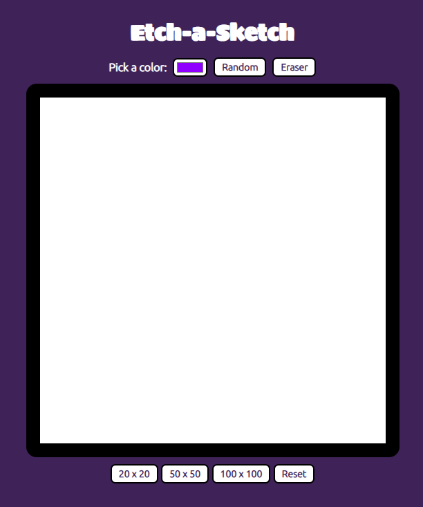
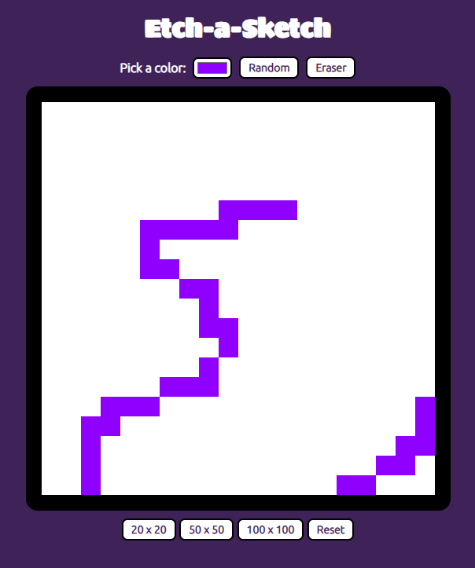

# (Quadro de Anotação e Desenho) Etch-a-Sketch


## Table of contents

- [Overview](#overview)
  - [The challenge](#the-challenge)
  - [Screenshots](#screenshots)
  - [Links](#links)
- [My process](#my-process)
  - [Built with](#built-with)
  - [What I learned](#what-i-learned)
  - [Continued development](#continued-development)
  - [Useful resources](#useful-resources)
- [Author](#author)

## Overview

### The challenge

Users should be able to:

- Select a color to paint the board;
- Select a random color from a button;
- Choose the size of the grid (20x20, 50x50, 100x100);
- Reset the grid;
- Select a eraser from a button.

### Screenshots





### Links

- Solution URL: [GithHub Repository](https://github.com/danielrsouza10/etch-a-sketch)
- Live Site URL: [Interactive Rating Component](https://danielrsouza10.github.io/etch-a-sketch/)

## My process

### Built with

- Semantic HTML5 markup
- CSS custom properties
- Flexbox
- Javascript

### What I learned

Improved the manipulation of the DOM with JavaScript.
Improve functions on JavaScript.
Make clean HTML and CSS.
Feeling more confortable using Events and the manipulation of the DOM with JavaScript.

```css
.grid{
    max-width: 540px;
    border: 20px solid black;
    border-radius: 15px;
    display: flex;
    flex-wrap: wrap;
    margin: 0;
}
```
```js
//default grid
const container = document.querySelector('#container');
const grid = document.createElement('div');
grid.className = 'grid';
container.appendChild(grid);
//loop to create the default grid
for (i = 0; i < 400; i++) {
    const box = document.createElement('div');
    box.className = 'box';
    box.style.width = '25px';
    box.style.height = '25px';
    // box.style.border = '0.1px solid lightgray';
    box.style.backgroundColor = 'white';
    document.querySelector('.grid').appendChild(box);
}
```

```js
// function to create other grids
function createNewGrid(size) {
    const container = document.querySelector('#container');
    const grid = document.createElement('div');
    grid.className = 'grid';
    container.appendChild(grid);

    let result = 0;
    //verifing the return of the button that was pressed
    if (choice === '20 x 20' || choice === 'Reset') {
        size = 20 * 20;
        result = '25px';
    } else if (choice === '50 x 50') {
        size = 50 * 50;
        result = '10px';
    } else{
        size = 100 * 100;
        result = '5px';
    }

    for (i = 0; i < size; i++) {
        //create new div
        const newGrid = document.createElement('div');
        newGrid.className = 'newBox';
        newGrid.style.width = result;
        newGrid.style.height = result;
        // newGrid.style.border = '.1px solid lightgray';
        newGrid.style.backgroundColor = 'white';
        document.querySelector('.grid').appendChild(newGrid);
    }
}
```

### Continued development

Now I will search for more ways to improve CSS Grid Layout and Bootstrap.

### Useful resources

- [The Odin Project](https://www.theodinproject.com) - This helped me for DOM Manipulation.

## Author

- Website - [Linkedin](https://www.linkedin.com/in/danielrsouza/)
- Instagram - [@danielrsouza](https://www.instagram.com/danielrsouza)

This is a solution to the [Etch-a-Sketch](https://www.theodinproject.com/lessons/foundations-etch-a-sketch).
